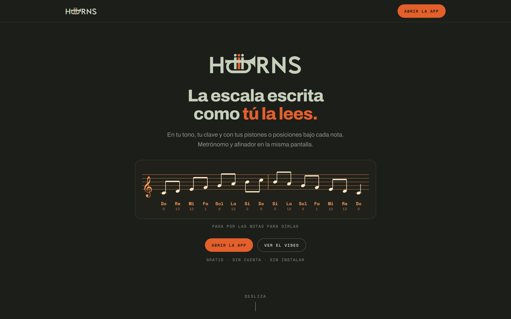
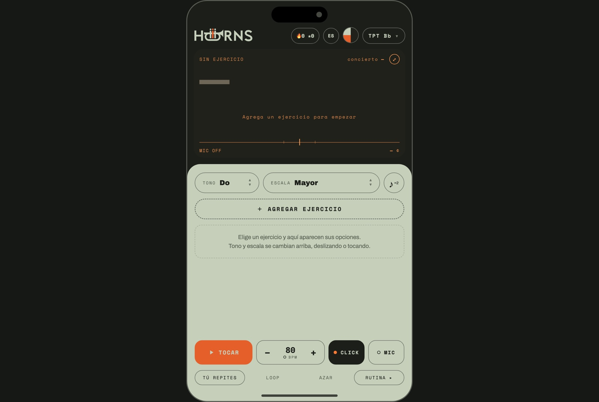

# HORNS

### La escala escrita como tú la lees

Para trompeta, trombón y saxofón.
En tu tono, tu clave y con tus pistones o posiciones bajo cada nota.

`Gratis` · `Sin cuenta` · `Sin instalar`

 

## Qué resuelve

Un músico de viento abre cuatro apps para practicar: partitura, digitaciones,
metrónomo y afinador. HORNS las junta en una pantalla — y todo se transpone
automáticamente a la clave real de tu instrumento.

 

 

## Qué trae

| | |
|---|---|
| **Escalas** | Cualquier tono, cualquier escala, escritas en pentagrama |
| **Digitaciones** | Pistones y posiciones debajo de cada nota |
| **Metrónomo** | Click con BPM ajustable |
| **Afinador** | Entrada de micrófono en la misma pantalla |
| **Modos** | Tú repites · Loop · Azar · Rutina |
| **Rutinas** | Ejercicios encadenados en una sesión |
| **Racha** | Contador de días de práctica |
| **Idiomas** | Español e inglés |

Notas con audio: pasas por encima y suenan.

 

## Estado

App web terminada, construida como PWA — se instala desde el navegador.
Pendiente de desplegar.

 

---

**Red Tiger Studio**

