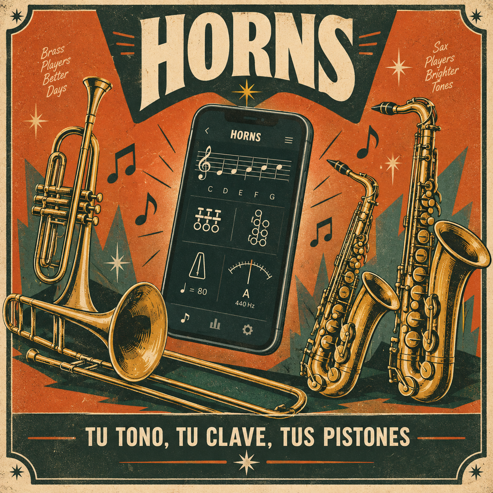
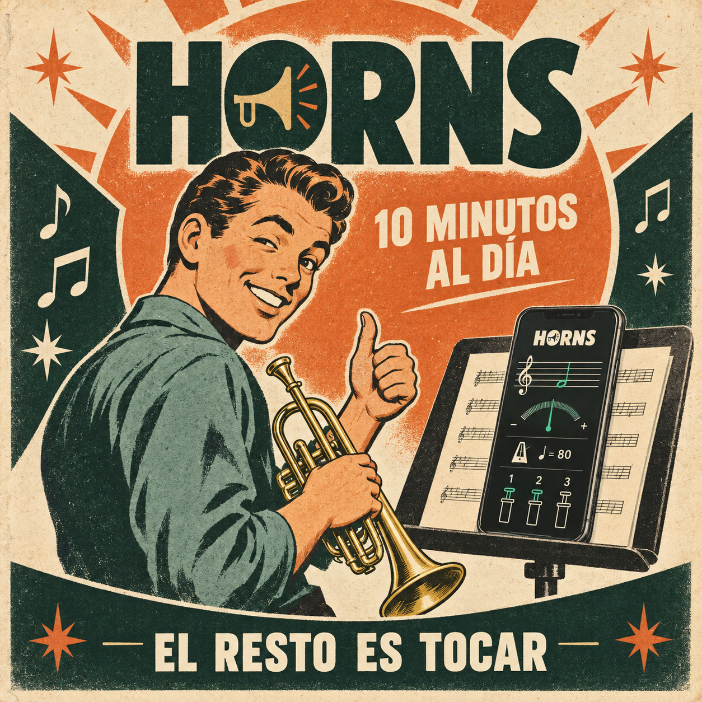
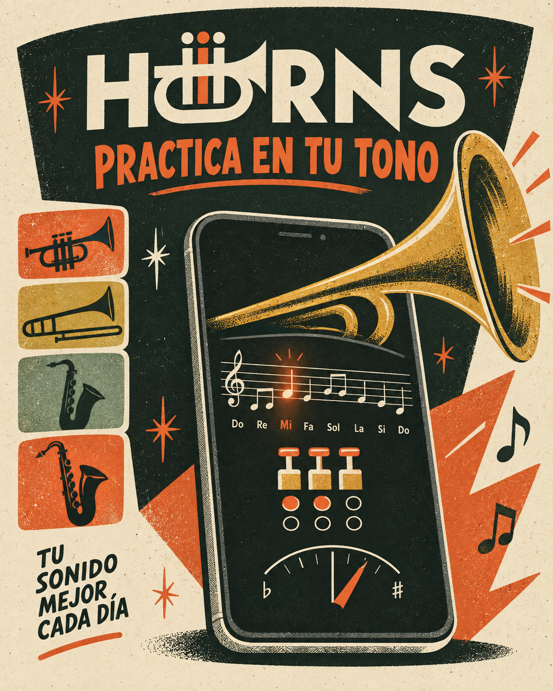

# HORNS

### Tu tono, tu clave, tus pistones

App de práctica para músicos de viento.
Trompeta · Trombón · Saxofón

 

 

## Qué resuelve

Un músico de viento necesita cuatro herramientas para practicar y termina con
cuatro apps abiertas. HORNS las junta en una, y todo se adapta a la transposición
de tu instrumento.

| | |
|---|---|
| **Partitura** | Notas y escalas en pantalla |
| **Digitaciones** | Pistones y llaves — trompeta, trombón, sax |
| **Metrónomo** | Tempo ajustable |
| **Afinador** | Referencia A 440 Hz |
| **Transposición** | Todo en la clave real de tu instrumento |

 

> *Brass players, better days. Sax players, brighter tones.*

 

 

## Estado

En concepto. Identidad visual y campaña definidas. Destino: App Store.

 

---

**Red Tiger Studio**

